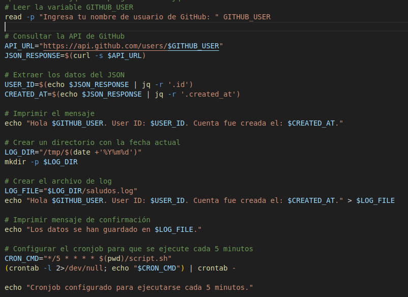
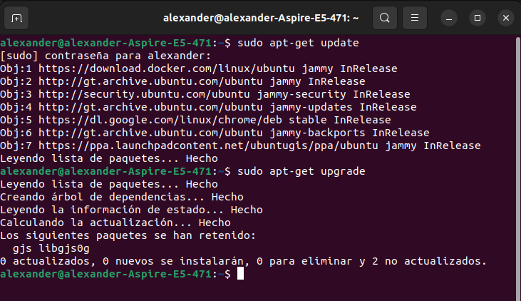
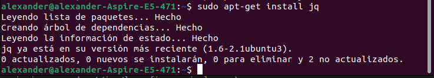
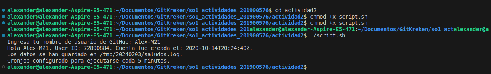

Universidad de San Carlos de Guatemala  
Facultad de Ingeniería  
Escuela de Ciencias y Sistemas  
Sistemas Operativos 1  

# Actividad 2 - Scripting

Brayan Alexander Mejia Barrientos  
201900576  
03/02/2024  

Esta actividad consiste en crear un script en BASH que permita consultar los datos de un usuario de GITHUB. Los datos del usuario seran descargado de un webservice. Luego este debera de escribir un log con algunos de los datos del usario.

## Codigo del Script

## Instalacion de dependencias para el correcto funcionamiento

El script utiliza curl para consultar la API de GitHub y jq para parsear el JSON.Asegurate de tener instaladas estas herramientas antes de ejecutar el script.

sudo apt-get update

sudo apt upgrade

sudo apt-get install jq

Tambien es importante concederle los permisos de ejecucion al archivo 

chmod +x "nombre_script".sh

y para ejecutarlo 

./script.sh  
  
  

## Script ejecutandose 

