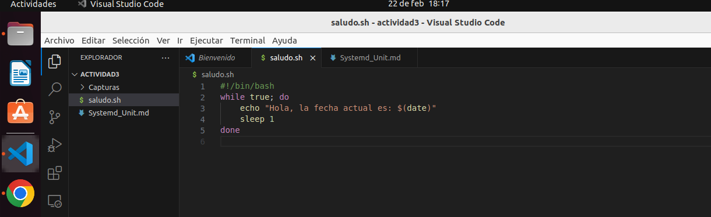
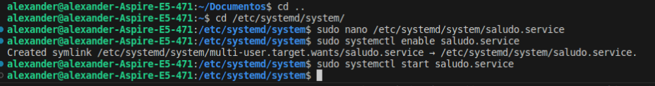

# Instalación del Servicio de Saludo

Se instalara y configurarara el servicio de saludo, el cual debe de imprimir un saludo y la fecha actual cada 1s indefinidamente

## Paso 1: Preparación del Script

1. Crea un archivo de script llamado `saludo.sh` con el siguiente contenido:

    ```bash
    #!/bin/bash
    while true; do
        echo "Hola, la fecha actual es: $(date)"
        sleep 1
    done
    ```

   

3. Guarda el archivo `saludo.sh` en el directorio `/usr/local/bin/`:

    ```bash
    sudo cp saludo.sh /usr/local/bin/
    sudo chmod +x /usr/local/bin/saludo.sh
    ```

   

## Paso 2: Creación del Archivo de Unidad Systemd

1. Crea un archivo de unidad systemd llamado `saludo.service` en el directorio `/etc/systemd/system/` con el siguiente contenido

Utilizamos el comando sudo nano /etc/systemd/system/saludo.service esto abrirá el editor nano con un archivo nuevo o vacío llamado saludo.service. que podemos editar copiar y pegar contenido en este archivo, debemos escribir el siguiente comando  
   
  ```
    plaintext
    [Unit]
    Description=Servicio de saludo

    [Service]
    ExecStart=/usr/local/bin/saludo.sh
    Restart=always
    StandardOutput=syslog
    StandardError=syslog
    SyslogIdentifier=saludo

    [Install]
    WantedBy=multi-user.target
 ```

El archivo saludo.service se compone de varias secciones:  

Description: Proporciona una breve descripción del servicio, en este caso, "Servicio de saludo".  

ExecStart: Especifica el comando para iniciar el servicio, aquí, /usr/local/bin/saludo.sh.  

Restart: Configura el servicio para reiniciarse automáticamente si se detiene por alguna razón, utilizando Restart=always.  

StandardOutput y StandardError: Indica dónde se redirigen la salida estándar y los errores del servicio. En este caso, ambos se envían al syslog del sistema.  

SyslogIdentifier: Define el identificador utilizado al enviar mensajes al syslog. Aquí, se establece como "saludo".  

Install: Especifica cómo debe ser instalada la unidad.  
  
WantedBy: Indica que el servicio es deseado por el objetivo multi-user.target, lo que asegura que se inicie automáticamente al arrancar el sistema en un entorno multiusuario.  

Editor nano:  
      

El archivo saludo.service es un archivo de unidad systemd que describe cómo systemd debe manejar el servicio "saludo"

3. Habilita el servicio para que se inicie automáticamente con el sistema:

    ```bash
    sudo systemctl enable saludo.service
    ```

## Paso 3: Iniciar el Servicio

Inicia el servicio con el siguiente comando:

```bash
sudo systemctl start saludo.service

```
  

## Paso 4: Verificar los logs  

journalctl -u saludo.service  


