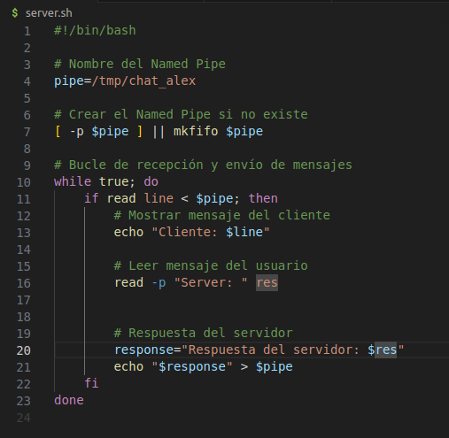
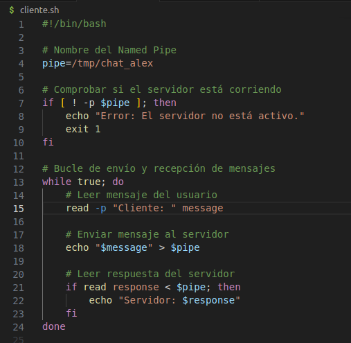
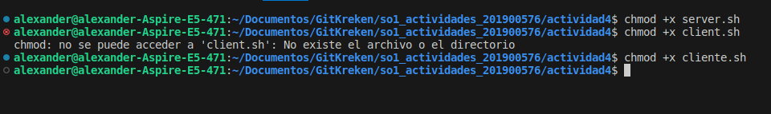
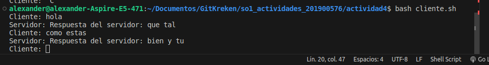
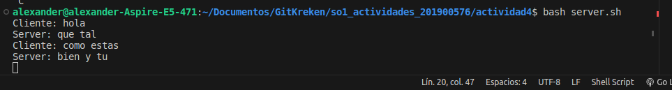

### Chat Basico con Named Pipes

1. **Crea los scripts**:
   - Crea los archivos:
     - [server.sh](#)
     - [client.sh](#)  
   - script para el server  
     
   - script para el cliente  
     


2. **Abre una terminal**:
   - Abre una terminal o una pestaña de terminal en tu sistema Linux.

3. **Permisos de ejecución**:
   - Si es necesario, otorga permisos de ejecución a los scripts descargados. Puedes hacerlo con el comando `chmod +x server.sh` && `chmod +x cliente.sh`.
    
4. **Ejecuta el servidor**:
   - En la terminal, navega hasta el directorio donde guardaste `server.sh`.
   - Ejecuta el servidor con el comando:
     ```bash
     bash server.sh
     ```
5. **Ejecuta el cliente**:
   - Abre otra terminal o pestaña de terminal.
   - Navega hasta el directorio donde guardaste `client.sh`.
   - Ejecuta el cliente con el comando:
     ```bash
     bash client.sh
     ``` 
6. **Comienza a chatear**:
   - Una vez que el servidor y el cliente estén en funcionamiento, podrás comenzar a chatear.
   - Escribe un mensaje en el cliente y presiona Enter para enviarlo.
   - El mensaje será mostrado en la terminal del servidor.
      
         
7. **Finaliza el chat**:
   - Para finalizar el chat, puedes cerrar tanto el servidor como el cliente.
   - En cada terminal, puedes presionar `Ctrl + C` para detener la ejecución del script.
