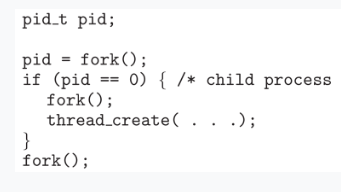
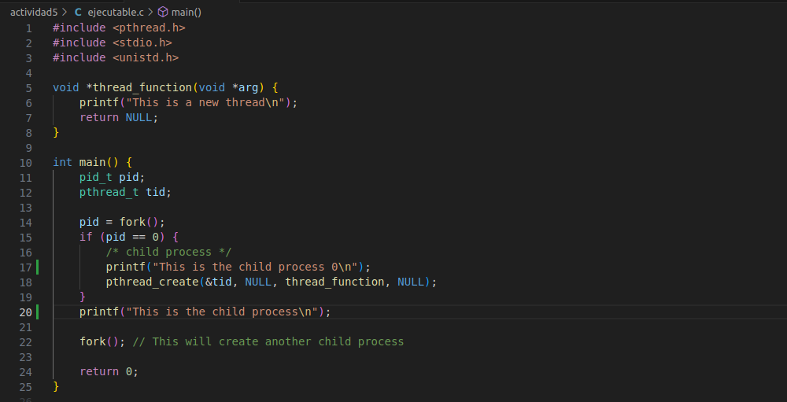
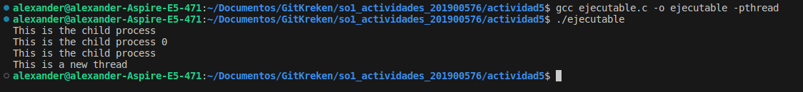

## Actividad 5 Pthread

Codigo inicial 

Codigo ya corregido

- pthread.h: Esta biblioteca proporciona las funciones y estructuras necesarias para trabajar con hilos en el - sistema.
- stdio.h: Biblioteca estándar de entrada y salida en C.
- unistd.h: Biblioteca que proporciona acceso a las funciones del sistema operativo relacionadas con la creación de procesos (fork()).  

- función thread_function es la rutina que se ejecutará cuando se cree un hilo. Simplemente imprime un mensaje en la consola y devuelve NULL.

- pid_t pid: Declaración de una variable para almacenar el ID del proceso.
pthread_t tid: Declaración de una variable para almacenar el ID del hilo.
- pid = fork(): Se crea un proceso hijo utilizando la función fork(). El valor devuelto (pid) indica si estamos en el proceso hijo o en el proceso padre.
- if (pid == 0) { ... }: Si el valor de pid es 0, estamos en el proceso hijo, por lo que se ejecuta el código dentro de este bloque.
pthread_create(&tid, NULL, thread_function, NULL);: Se crea un nuevo hilo utilizando la función pthread_create(). Este hilo ejecutará la función thread_function.
- fork();: Se realiza otra bifurcación, lo que resulta en la creación de otro proceso hijo.

### Ejeuccion del codigo corregido

### Respuestas a las preguntas:

a) **¿Cuántos procesos únicos son creados?**

El programa realiza dos bifurcaciones (fork()) desde el proceso principal. Cada bifurcación crea un nuevo proceso hijo. Por lo tanto, en total, se crearán 4 procesos únicos. Uno será el proceso principal y los otros tres serán los procesos hijos resultantes de las bifurcaciones.

b) **¿Cuántos hilos únicos son creados?**

Cada vez que se llama a pthread_create() dentro de un proceso hijo (después de la bifurcación), se crea un nuevo hilo. En este caso, pthread_create() se llama dentro de un proceso hijo después de la primera bifurcación. Entonces, se creará un hilo único en uno de los procesos hijos. Como resultado, se creará un hilo único.
